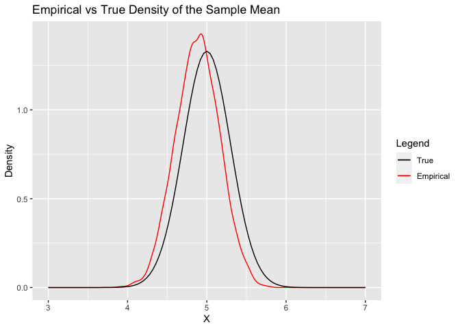

## Motivation

I just learned about the boostrap, which appears to be a versatile and
powerful technique. The purpose of this short notebook is to convince
myself that it actually works.

## Toy Example

Perhaps the easiest way to use the boostrap is to estimate the mean and
variance of the sample mean. First let’s simulate some data.

``` r
n = 100 #sample size
mu = 5 #mean
sigma = 3 #sd

X = rnorm(n, mu, sigma) 
```

So here we have a random sample of 100 points drawn from 𝒩(5,9). Next we
can take bootstrap samples from **X** to estimate the sample mean and
its variance.

We expect (asymptotically) *X̄* ∼ 𝒩(5,0.09). Let’s see how well our
bootstrap estimates hold up to the theory.

``` r
B = 10000 #number of bootstrap samples
b_i = numeric(n) #to store each bootstrap sample
xbar_i = numeric(B) #to store the sample means


for (i in 1:length(xbar_i)) {
  b_i = sample(X, size = n, replace = TRUE) #sample n points from X with replacement
  xbar_i[i] = mean(b_i) # take sample mean of bootstrap sample
}
```

First we can estimate the mean of the sample mean

``` r
mu_xbar = mean(xbar_i)
mu_xbar
```

    ## [1] 4.882288

Next we can estimate the variance of the sample mean

``` r
sigma_xbar = var(xbar_i)
sigma_xbar
```

    ## [1] 0.07751384

We see that the bootstrap estimated mean, 4.8822882, and variance,
0.0775138, are remarkably close to the true theoretical asymptotic mean,
5, and variance, 0.09.

We can also use the 2.5% and 97.5% percentiles to estimate a 95%
confidence interval.

``` r
quantile(xbar_i, c(.025, .975))
```

    ##     2.5%    97.5% 
    ## 4.340356 5.426361

Let’s compare this to the confidence interval we would get from using
the estimated variance.

``` r
cat(paste0("(",round(mu_xbar-1.96*sqrt(sigma_xbar),6),", ",round(mu_xbar+1.96*sqrt(sigma_xbar),6),")"))
```

    ## (4.336599, 5.427978)

These are pretty close.

Finally, we can actually plot the entire empirical pdf against the true
pdf

``` r
library(ggplot2)

df = as.data.frame(xbar_i)
colors = c("True" = "black", "Empirical" = "red")

ggplot(df, aes(x =  xbar_i)) +
  stat_density(aes(color = "Empirical"), geom = "line", position = "identity") +
  stat_function(fun = dnorm,
                args = list(mean = mu,
                            sd = sigma/sqrt(n)),
                aes(color = "True")) +
  labs(title = "Empirical vs True Density of the Sample Mean",
       x = "X",
       y = "Density",
       color = "Legend") +
  scale_color_manual(values = colors) +
  xlim(c(3,7))
```

<!-- -->

So now we’ve shown not only that bootstrapping can accurately
approximate the mean and variance of the sample mean, but the density is
also approximately normally-distributed.

I think I’ve proved to myself that despite its simplicity, the bootstrap
does in fact work to characterize estimators very well. This example
was, of course, trivial because we know the sampling distribution of the
sample mean due to the Central Limit Theorem, but if the sampling
distribution is unknown, the bootstrap is a great tool.
